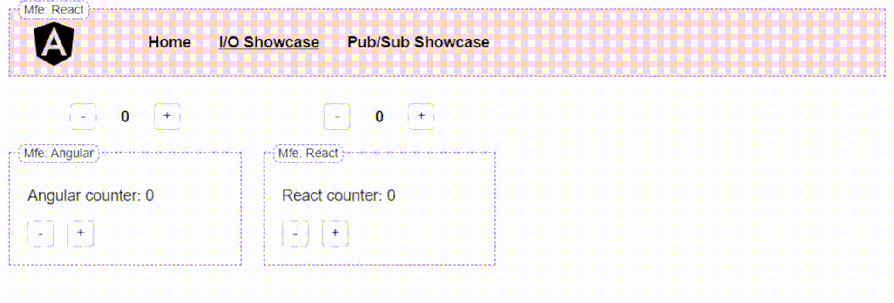
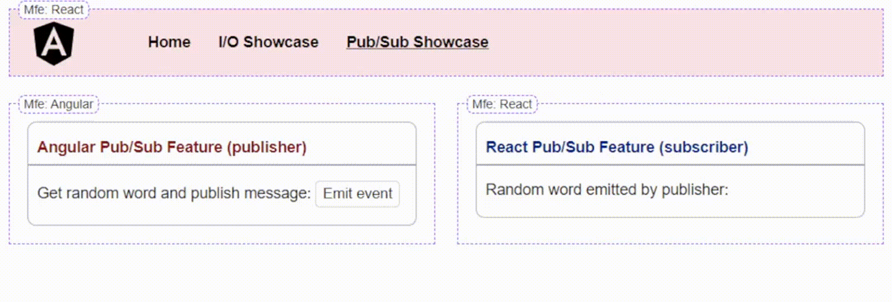
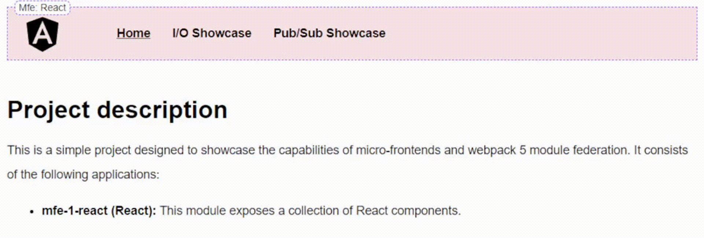

# MfePlayground
This is a simple project designed to showcase the capabilities of micro-frontends and webpack 5 module federation.

## Project description

Project consists of the following applications:

- **mfe-1-react (React):** This module exposes a collection of React components.
- **mfe-2-angular (Angular):** In this module, a set of Angular components is made available for remote consumption.
- **shell (Angular):** The host application relies on both mfe-1-react and mfe-2-angular to provide a unified user experience. The app is implemented using Angular, but React is also being used to power up remote react-based components.

This demonstrates how module federation allows you to combine different technologies within a single application, enhancing your development flexibility and enabling you to leverage the strengths of multiple frameworks.

The main idea behind this implementation was to use remote components in the same way we use local ones. That's why a couple of adapter abstractions were developed to provide a convenient and familiar developer experience for each loaded component.

It uses several frameworks/libraries under the hood to be able to power up remote components and use them the same way as local ones.
## Development server

Run `npm run deps:all` to install all dependencies. Run `npm run start:all` to start all micro-frontends and shell application by one button press.

You can also run these commands to start each app separately:
- `npm run start:mfe-1-react`
- `npm run start:mfe-2-angular`
- `npm run start:shell`

## Implementation notes

The key files of this project:
- [mfe-utils/module-federation.ts](apps/shell/app/mfe-utils/module-federation.ts) - set of utility functions for loading remote mfe modules.
- [mfe-utils/mfe-react-component.ts](apps/shell/app/mfe-utils/mfe-react-component.ts) - abstract adapter for remote react components.
- [mfe-utils/mfe-angular-component.ts](apps/shell/app/mfe-utils/mfe-angular-component.ts) - abstract adapter for remote angular components.
- [services/pub-sub.service.ts](apps/shell/app/services/pub-sub.service.ts) - pub/sub service for sharing messages between different modules of the app.
- [services/navigation.service.ts](apps/shell/app/services/navigation.service.ts) - navigation service.

### Input/Output demo:

### Pub/Sub demo:

### Navigation demo:


### Example of adapting remote Angular component:

```typescript
type ExampleComponentProps = {
  inputProp: unknown;
  outputChange: EventEmitter<unknown>
}

@Component({
  selector: 'mfe-example',
  standalone: true,
  imports: [CommonModule],
  template: '<ng-container #container></ng-container>',
  changeDetection: ChangeDetectionStrategy.OnPush,
})
export class MfeExampleComponent extends MfeAngularComponent<ExampleComponentProps> {
  public readonly configuration: FederationPluginMetadata = {
    element: 'ExampleComponent',
    remoteName: 'mfeAngular',
    exposedModule: 'ExampleComponent',
    remoteEntry: 'http://localhost:4002/remoteEntry.js'
  }

  @ViewChild('container', { static: true, read: ViewContainerRef })
  readonly viewContainerRef!: ViewContainerRef;
}
```

### Example of adapting remote React component:

```typescript
type ExampleComponentProps = {
  inputProp: unknown;
  onOutputChange: (event: unknown) => void;
}

@Component({
  selector: 'mfe-example',
  standalone: true,
  imports: [CommonModule],
  template: '',
  changeDetection: ChangeDetectionStrategy.OnPush,
})
export class MfeExampleComponent extends MfeReactComponent<ExampleComponentProps> {
  public readonly configuration: FederationPluginMetadata = {
    element: 'Example',
    remoteName: 'mfeReact',
    exposedModule: 'Example',
    remoteEntry: 'http://localhost:4001/remoteEntry.js'
  }
  public readonly useNavigationService: boolean = false;
  public readonly usePubSubService: boolean = true;
}
```
